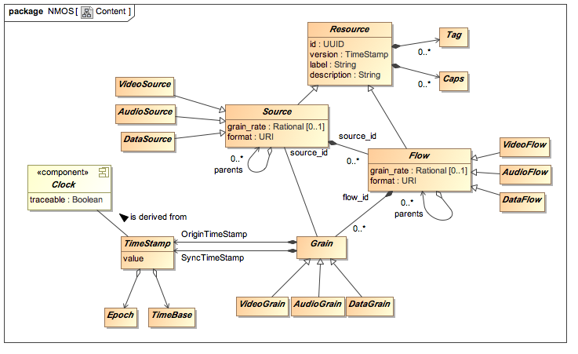

# AMWA NMOS Content Model Specification
(c) AMWA 2016

NMOS Specifications shall be consistent with the logical content model represented by the following UML class diagram, and defined in this document.

The elements of this model are abstract, and other NMOS Specifications define how these map into interfaces, for example to convey in-stream identity and timing information in an RTP stream.

This model is based on the data model documented in JT-NM RA 1.0, with a number of simplifications and specializations:

- Only elements from the model that are directly about content in NMOS specifications are included (so Node, Device, Sender, Receiver are not included).
- Currently, "grouping" elements such as SourceGroup and Rendition are not included.
- The Content element, and related elements, are only informative in the JT-NM RA 1.0 data model and are not included.
- NMOS specifications are constrained to use a nanosecond TimeBase and PTP/SMPTE Epoch.
- NMOS specifications constrain a video Grains to correspond to a frame.
- A Grain has exactly two TimeStamps (Origin and Sync).
- Various attributes are defined that are not in the scope of the JT-NM RA.
- Some attribute values with URI type are constrained to have a "urn:x-nmos:" prefix.

## Clock
A Clock is a network component providing a ubiquitous time reference.  It may be **traceable**, meaning it is synchronized to International Atomic Time (TAI); a PTP Clock is traceable.

## Epoch
An Epoch specifies the time that corresponds to the zero value of a Clock.

NMOS specifications shall use the PTP/SMPTE Epoch, i.e. 1 January 1970 00:00:00 TAI.

## TimeStamp
A TimeStamp is an absolute time, that is, an offset from the start of an Epoch.

## TimeBase
A TimeBase specifies the units used for TimeStamps.

NMOS specifications shall use a TimeBase with nanoseconds (so TimeStamps are an integer number of nanoseconds).

_Note: This is based on the timebase used by PTP. This requires 80 bits, so in practice is typically mapped to a (second, nanosecond) pair._

## Grain
A Grain represents an element of video, audio or data that is associated with a particular time. This video, audio or data is called the **Grain Payload**:

- A **VideoGrain** has a Grain Payload containing video sample data.

  In NMOS specifications a VideoGrain shall have a Grain Payload corresponding to a **single, complete, frame of video**.

  *Note: This means that both fields of an interlaced frame have the same timestamp. See also the interlace_mode parameter of VideoFlow.*

- An **AudioGrain** has a Grain Payload containing audio sample data from one or more audio channels.

- A **DataGrain** contains generic time-related data, for example a frame's worth of ANC data, as per TR-03.

A Grain is contained in a Flow.

Grains shall have the following attributes:

- **SourceID**: Unique identifier of the Source that produced the Grain.
- **FlowID**: Unique identifier of the Flow that contains the Grain.
- **OriginTimeStamp**: A TimeStamp representing when the Grain was captured. When capturing from a live source this should match the SyncTimeStamp. When replaying stored essence this should be populated from the Origin Timestamp of the stored Grain.
- **SyncTimeStamp**: a TimeStamp representing when timestamp for the
Grain essence data. Two coincident audio and video Grains would share the same
Sync Timestamp, which remains associated with them as they pass through
processing devices.

Grains may have the following optional attributes:

- SMPTE ST 12-1 (SMPTE 12M) Timecodes
- Grain Duration

A Grain's **unique identity** is provided by the combination of the FlowID and OriginTimeStamp.

## Resource

An Resource is a uniquely identifiable and addressable element of a system that implements an NMOS specification. In this specification, Flows and Sources are Resources.

Resources shall have the following attributes:

- **id**: a Univerally Unique IDentifier (UUID) as per RFC 4122.
- **version**: a TimeStamp indicating when an attribute of the Resource last changed.
- **label**: a short string providing a human-readable identifying for the Resource. Does not have to be unique.
- **description**: a longer string providing a description of the Resource.

Resources may have the following attributes:

- **tags**: Text-based tags providing information about the resource.
- **caps**: Capabilities of the Resource. Usage of these is not yet defined.

## Flow

A Flow is a (temporal) sequence of Grains from a Source. The Grains shall be of the same type, so:

- **VideoFlows** contain only VideoGrains.
- **AudioFlows** contain only AudioGrains.
- **DataFlows** contain only DataGrains.

Flows shall have the following attributes in addition to those specified by the Resource base class:

- **source_id**: the UUID identifying the Source that is the logical origin of the Flow.
- **parents**: UUIDs referencing all of the Flows that were brought together to create this Flow, for example as a result of a vision mixing operation.
- **format**: a URI starting with "urn:x-nmos:format:", followed by "video", "audio", "data", according to to the type of Flow.  This may be followed by a suffix indicating a more specific type, e.g. "urn:x-nmos:format:video.raw".

Flows may have the following optional attributes:

- **grain_rate**: a rational number of Grains per second. Should only be present in a periodic Flow, i.e. where the Grains are regularly spaced in time.

  *Note: NMOS Flows may have irregularly spaced Grains, for example a flow of Data Grains representing events. Such Flows do not have a grain_rate attribute.*

## Source

A Source represents the primary origin of a Flow, or a set of Flows that contain "editorially equivalent" content (such as a full-resolution and reduced-resolution versions of the same video).

Sources may be one of following types:

- **VideoSource**, origin of VideoFlow(s)
- **AudioSource**, origin of VideoFlow(s)
- **DataSource**, origin of DataFlow(s)

Sources shall have the following attributes in addition to those specified by the Resource base class:

- **parents**, UUIDs referencing all of the Sources whose Flows were brought together (see Flow's parents attribute).
- **format**: a URI starting with "urn:x-nmos:format:", followed by "video", "audio", "data", according to to the type of Source.

Sources may have the following optional attributes:

- **grain_rate**: a rational number indicating the maximum number of grains per second that may be used for Flows derived from this Source. Should only be present where the Flows are periodic.

  *Note: individual Flows may have a lower value of grain_rate than their Source.*
